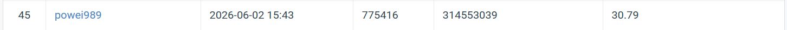

# HW4: Blind Image Restoration for Rain and Snow

This repository implements **PromptIR** extended with Contrastive Prompt Learning (CPL), Task Uncertainty Regularisation (TUR), and 8-fold Test-Time Augmentation (TTA) for blind image restoration of rain and snow degradations.

## Leaderboard Results

| Configuration | Leaderboard PSNR (dB) |
|---|---|
| Base (PromptIR) | 30.45 |
| Base + CPL | 30.43 |
| Base + CPL + TUR | 30.48 |
| **Base + CPL + TUR + TTA** | **30.79** |



---

## 1) Environment Setup

```bash
conda env create -f env_hw4.yml
conda activate promptir-hw4
```

Verify CUDA and PyTorch:

```bash
python -c "import torch; print(torch.__version__, torch.cuda.is_available())"
```

## 2) Dataset Structure

Expected directory layout:

```text
data/release_folder/hw4_realse_dataset/
  train/
    clean/
    degraded/
  test/
    degraded/
```

Use `--data_root` to override the default path if your data is stored elsewhere.

## 3) Training from Scratch

`train_hw4.py` trains from scratch by default (no pretrained weights).

```bash
python train_hw4.py \
  --data_root data/release_folder/hw4_realse_dataset \
  --save_dir ckpt/hw4 \
  --epochs 200 \
  --batch_size 8 \
  --patch_size 128 \
  --num_workers 8 \
  --amp
```

Outputs:

- `ckpt/hw4/best.pth` — checkpoint with best validation PSNR
- `ckpt/hw4/last.pth` — checkpoint from the final epoch

## 4) Generate Submission File (`pred.npz`)

```bash
python eval_hw4.py \
  --data_root data/release_folder/hw4_realse_dataset \
  --ckpt ckpt/hw4/best.pth \
  --output_npz data/release_folder/pred.npz
```

`pred.npz` format:

- **key**: test image filename (e.g. `0.png`)
- **value**: `uint8` numpy array of shape `(3, H, W)`

This matches the reference format in `data/release_folder/pred.npz`.

## 5) Generate Submission with TTA (best score)

```bash
python eval_hw4.py \
  --data_root data/release_folder/hw4_realse_dataset \
  --ckpt ckpt/hw4/best.pth \
  --output_npz data/release_folder/pred.npz \
  --tta
```
